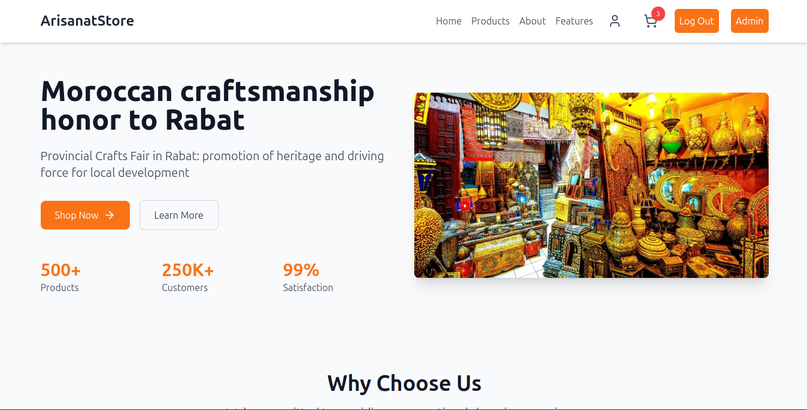

# E-commerce Platform

### Main Page

### Main Page

## Project Overview

This project is an e-commerce website with different spaces for regular users and administrators. It connects user authentication with inventory management to create a complete online shopping experience.

## Main Features

### For Regular Users
- **Shop Page**: Browse all products displayed as cards
- **Product Details Page**:
  - Full product description
  - Technical details
  - Similar products section
- **User Profile Management**:
  - Update personal information (name, email, password)

### For Administrators
- Access to product management dashboard
- Inventory control
- User management functions

## Technology Stack

### Frontend
- **React JS**: For building the user interface
- **Tailwind CSS**: For styling and responsive design
- **Yup**: For frontend data validation

### Backend
- **Node.js & Express.js**: For creating the server and API
- **Mongoose**: For database operations
- **Validator.js**: For backend data validation

### Database
- **MongoDB**: For storing product and user data

### Authentication
- **JWT (JSON Web Tokens)**: For secure authentication
- **OAuth**: For login with Google, GitHub, or Facebook

### Tools
- **Postman**: For testing APIs
- **GitHub**: For version control
- **Draw.io**: For creating UML diagrams

## Project Workflow

1. **User Login**:
   - Users sign in with email/password
   - System checks user role (admin or regular user)
   - Redirects to appropriate dashboard based on role

2. **Shopping Experience**:
   - Browse products in the shop
   - View detailed product information
   - Manage personal profile

3. **Admin Functions**:
   - Manage product inventory
   - View user information
   - Monitor shop performance

## Technical Requirements

- Secure JWT/OAuth authentication with role management
- Complete data validation (Yup for frontend, Validator.js for backend)
- Fully functional shop with dynamic product display
- Detailed product pages with description, similar items, and reviews
- User profile management
- Integration with existing stock and user APIs
- Responsive and user-friendly design
- Effective team collaboration

## Installation and Setup

1. Clone the repository:
